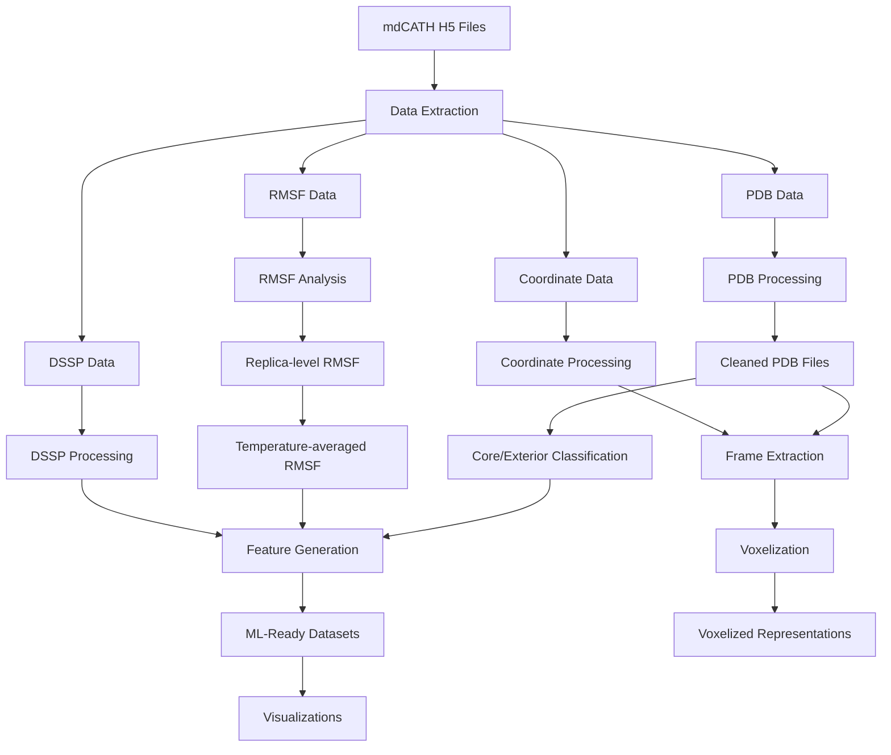
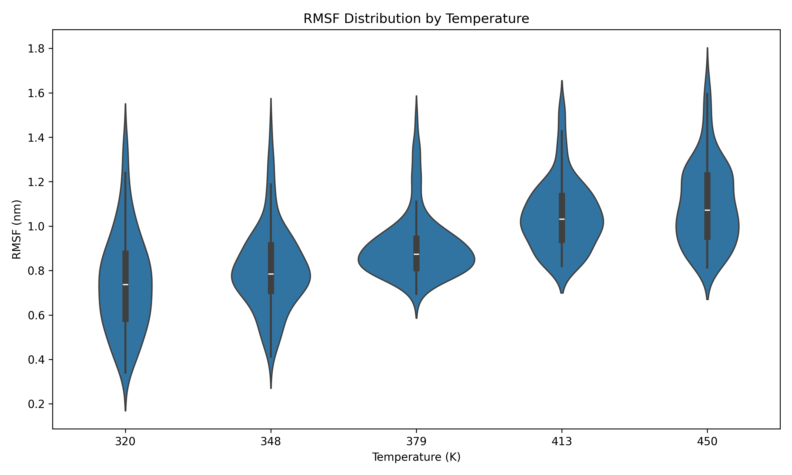
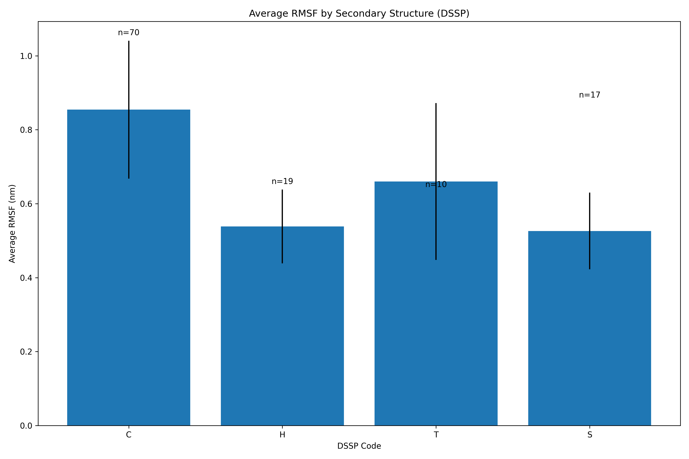
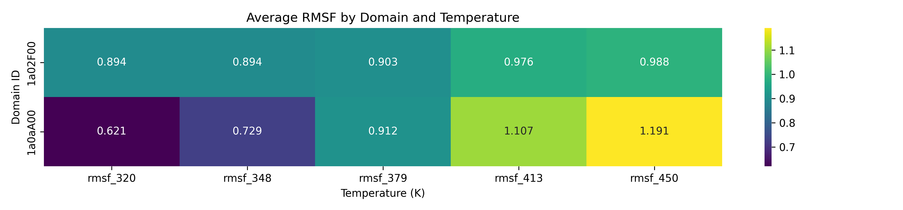

# 🧪 mdCATH Dataset Processor

[](https://opensource.org/licenses/MIT)
[](https://www.python.org/downloads/)
[](https://github.com/Felixburton7/mdcath-processor)
[](https://github.com/Felixburton7/mdcath-processor)

A comprehensive suite for processing mdCATH protein dynamics dataset to facilitate machine learning-based prediction of Root Mean Square Fluctuation (RMSF) from protein structures.

---

## 📑 Table of Contents

<div style="display: grid; grid-template-columns: 1fr 1fr; grid-gap: 20px; margin-bottom: 30px;">
<div>

### Getting Started
- [🌟 Overview](#-overview)
- [🔬 Key Features](#-key-features)
- [⚙️ Installation](#️-installation)
- [🚀 Quick Start](#-quick-start)
  
### Core Documentation
- [🔄 Dataflow Pipeline](#-dataflow-pipeline)
- [🛠️ Configuration Options](#️-configuration-options)
- [📊 Output Examples](#-output-examples)

</div>
<div>

### Technical Details
- [📂 Project Structure](#-project-structure)
- [🧩 Modules Explained](#-modules-explained)
- [🔮 Advanced Usage](#-advanced-usage)

### Resources
- [📚 API Reference](#-api-reference)
- [🐞 Troubleshooting](#-troubleshooting)
- [🤝 Contributing](#-contributing)
- [📜 License](#-license)

</div>
</div>

---

## 🌟 Overview

The mdCATH Dataset Processor is designed to transform raw molecular dynamics data from the mdCATH dataset into structured, analysis-ready formats optimized for machine learning applications. This pipeline extracts, processes, and organizes protein dynamics data, with a focus on Root Mean Square Fluctuation (RMSF) prediction.

By providing a consistent framework for data preparation, this project enables researchers to develop machine learning models that can accurately predict protein dynamics from structural features alone, potentially accelerating drug discovery and protein engineering efforts.

## 🔬 Key Features

- **Comprehensive Data Extraction**: Extract RMSF, DSSP, and coordinate data from mdCATH H5 files
- **Sophisticated PDB Processing**: Clean and standardize PDB files for downstream analysis
- **Multi-temperature Analysis**: Process data across multiple temperatures (320K-450K) and replicas
- **Core/Exterior Classification**: Classify protein residues as core or exterior using DSSP-based solvent accessibility
- **ML-Ready Feature Generation**: Create feature sets optimized for machine learning applications
- **Insightful Visualizations**: Generate publication-quality visualizations of RMSF distributions and correlations
- **Voxelized Representation**: Convert protein structures to voxelized format for 3D deep learning
- **Frame Selection**: Extract representative frames from trajectories using RMSD or gyration radius clustering

## ⚙️ Installation

### Prerequisites

- Python 3.9+
- H5py for handling HDF5 files
- Biopython for PDB handling and DSSP calculations
- aposteriori (optional, for voxelization)
- pdbUtils (recommended, for enhanced PDB processing)

### Setup

1. Clone the repository:
```bash
git clone https://github.com/Felixburton7/mdcath-processor.git
cd mdcath-processor
```

2. Install dependencies:
```bash
pip install -r requirements.txt
```

3. Install additional tools:
```bash
# For voxelization support
pip install aposteriori

# For enhanced PDB handling
pip install pdbUtils
```

4. Verify installation:
```bash
python check_environment.py
```

## 🚀 Quick Start

### Basic Usage

```bash
# Process default domains with standard settings
python main.py

# Process specific domains
python main.py --domain_ids 12asA00 153lA00

# Use custom configuration
python main.py --config my_config.yaml
```

### Example Workflow

```python
# Import necessary modules
from src.mdcath.core.data_loader import H5DataLoader, process_domains
from src.mdcath.processing import pdb, rmsf, features, visualization

# Load configuration
import yaml
with open('src/mdcath/config/default_config.yaml', 'r') as f:
    config = yaml.safe_load(f)

# Adjust configuration as needed
config['input']['domain_ids'] = ['12asA00', '153lA00']
config['output']['base_dir'] = './custom_outputs'

# Process domains
domain_results = process_domains(config['input']['domain_ids'], 
                                config['input']['mdcath_folder'], 
                                config)

# Process PDB data
pdb_results = pdb.process_pdb_data(domain_results, config)

# Process RMSF data
rmsf_results = rmsf.process_rmsf_data(domain_results, config)

# Generate ML features
ml_results = features.process_ml_features(rmsf_results, pdb_results, domain_results, config)

# Generate visualizations
vis_results = visualization.generate_visualizations(rmsf_results, ml_results, domain_results, config)
```

## 🔄 Dataflow Pipeline

The mdCATH processor transforms raw H5 data through a sophisticated pipeline of processing steps:



### Detailed Process Flow:

1. **Data Extraction**
   - Raw H5 files are parsed to extract PDB structures, RMSF values, DSSP annotations, and atomic coordinates
   - Data is organized by temperature and replica using the `H5DataLoader` class

2. **PDB Processing**
   - PDB files are cleaned and standardized with `fix_pdb` functions
   - Atom numbering is fixed, and unusual residue names are corrected
   - CRYST1 records are added for compatibility with analysis tools

3. **RMSF Analysis**
   - RMSF data is calculated for each residue across different replicas
   - Temperature-specific and temperature-averaged RMSF profiles are generated

4. **Structure Classification**
   - Residues are classified as core or exterior based on solvent accessibility
   - DSSP-based relative accessibility is used for this classification

5. **Frame Selection**
   - Representative frames are selected from trajectories using RMSD clustering, gyration radius filtering, or regular sampling
   - Frames are extracted as PDB files for visualization and further analysis

6. **Feature Generation**
   - Features are created by combining RMSF, structural, and sequence information
   - Data is normalized and encoded for machine learning applications
   - Secondary structure assignment and relative accessibility are included

7. **Visualization & Output**
   - Multiple visualizations are generated to provide insights into the data
   - All processed data is saved in structured formats for downstream use

## 🛠️ Configuration Options

The processing pipeline is highly configurable via a YAML configuration file. Here's a detailed breakdown of the key parameters from the actual implementation:

### Input/Output Configuration

```yaml
input:
  mdcath_folder: "/mnt/datasets/MD_CATH/data"  # Path to raw H5 files
  domain_ids: [                                # Domains to process (empty [] for all)
    "12asA00",
    "153lA00",
    "16pkA02",
    # More domains can be added here
  ]

temperatures: [320, 348, 379, 413, 450]  # Temperatures to process
num_replicas: 5                          # Number of replicas per temperature

output:
  base_dir: "./outputs"                  # Base directory for all outputs
```

### Processing Parameters

#### Frame Selection Options

```yaml
processing:
  frame_selection:
    method: "rmsd"        # Options: regular, rmsd, gyration, random
    num_frames: 4         # Number of frames to extract per domain/temperature
    cluster_method: "kmeans"  # For RMSD-based selection
```

#### PDB Cleaning Options

```yaml
processing:
  pdb_cleaning:
    replace_chain_0_with_A: true         # Replace chain '0' with 'A'
    fix_atom_numbering: true             # Fix inconsistent atom numbering
    correct_unusual_residue_names: true  # Convert non-standard residue names
    add_cryst1_record: true              # Add CRYST1 record for compatibility
    remove_hydrogens: false              # Remove hydrogen atoms
    remove_solvent_ions: true            # Remove water and ion molecules
    stop_after_ter: true                 # Stop processing after TER record
```

#### ML Feature Extraction

```yaml
processing:
  ml_feature_extraction:
    min_residues_per_domain: 0           # Min residues filter
    max_residues_per_domain: 50000       # Max residues filter
    normalize_features: true             # Normalize numeric features
    include_secondary_structure: true    # Include DSSP features
    include_core_exterior: true          # Include core/exterior classification
    include_dssp: true                   # Include per-residue DSSP data
```

#### Core/Exterior Classification

```yaml
processing:
  core_exterior:
    method: "msms"                       # Options: msms, biopython, fallback
    msms_executable_dir: "./msms_executables"
    ses_threshold: 1.0                   # Threshold for MSMS (Ų)
    sasa_threshold: 20.0                 # Threshold for Biopython SASA (Ų)
```

#### Voxelization Settings

```yaml
processing:
  voxelization:
    frame_edge_length: 12.0              # Physical size of voxel grid (Å)
    voxels_per_side: 21                  # Grid resolution
    atom_encoder: "CNOCBCA"              # Atom types to include
    encode_cb: true                      # Include CB atoms
    compression_gzip: true               # Compress output files
    voxelise_all_states: false           # Whether to voxelize all states in NMR structures
    process_frames: false                # Whether to also voxelize frame directories
    process_temps: [320, 348, 379, 413, 450]  # Temperatures to process for frame voxelization
```

#### Performance Tuning

```yaml
performance:
  num_cores: 10                          # 0 means auto-detect
  batch_size: 80                         # Batch size for parallel processing
  memory_limit_gb: 26                    # 0 means no limit
  use_gpu: true                          # Use GPU acceleration if available
```

#### Logging Options

```yaml
logging:
  verbose: true
  level: "INFO"
  console_level: "INFO"
  file_level: "DEBUG"
  show_progress_bars: true
```

### Configuration Examples

#### Minimal Configuration (Processing a Single Domain)

```yaml
input:
  mdcath_folder: "/path/to/mdcath/data"
  domain_ids: ["12asA00"]
temperatures: [320]
num_replicas: 1
output:
  base_dir: "./minimal_output"
```

#### Production Configuration (All Domains and Temperatures)

```yaml
input:
  mdcath_folder: "/path/to/mdcath/data"
  domain_ids: []  # Process all domains
temperatures: [320, 348, 379, 413, 450]
num_replicas: 5
output:
  base_dir: "./full_output"
performance:
  num_cores: 16
  memory_limit_gb: 32
  use_gpu: true
```

#### Advanced Frame Selection Configuration

```yaml
processing:
  frame_selection:
    method: "rmsd"               # Select frames based on RMSD clustering
    num_frames: 5                # Extract 5 representative frames
    cluster_method: "kmeans"     # Use k-means clustering

  # Additional processing options
  pdb_cleaning:
    remove_hydrogens: true       # Clean up PDB by removing hydrogens
    remove_solvent_ions: true    # Remove water molecules and ions
```

## 📊 Output Examples

The mdCATH processor generates multiple structured outputs for analysis and modeling. Here are key examples based on the actual implementation:

### 1. RMSF Analysis Results

**File: `outputs/RMSF/replica_average/average/rmsf_all_temperatures_all_replicas.csv`**

```csv
domain_id,resid,resname,rmsf_320,rmsf_348,rmsf_379,rmsf_413,rmsf_450,rmsf_average
12asA00,1,MET,1.243,1.321,1.467,1.589,1.723,1.469
12asA00,2,LYS,1.103,1.174,1.256,1.392,1.532,1.291
12asA00,3,ILE,0.936,0.987,1.075,1.156,1.267,1.084
```

This file contains average RMSF values across replicas and temperatures for each residue, providing a comprehensive view of protein flexibility.

### 2. ML-Ready Feature Datasets

**File: `outputs/ML_features/final_dataset_temperature_average.csv`**

```csv
domain_id,resid,resname,rmsf_320,rmsf_348,rmsf_379,rmsf_413,rmsf_450,protein_size,normalized_resid,core_exterior,relative_accessibility,dssp,resname_encoded,core_exterior_encoded,secondary_structure_encoded,phi_norm,psi_norm,rmsf_average
12asA00,1,MET,1.243,1.321,1.467,1.589,1.723,330,0.000,exterior,0.85,C,13,1,2,0.00,0.00,1.469
12asA00,2,LYS,1.103,1.174,1.256,1.392,1.532,330,0.003,exterior,0.63,T,12,1,2,-0.42,0.33,1.291
12asA00,3,ILE,0.936,0.987,1.075,1.156,1.267,330,0.006,core,0.15,E,9,0,1,-0.41,-0.75,1.084
```

This comprehensive dataset combines RMSF values with structural features:
- Temperature-specific RMSF values (`rmsf_320` through `rmsf_450`)
- `protein_size`: Total number of residues in the protein
- `normalized_resid`: Position in the sequence (normalized 0-1)
- `core_exterior`: Whether the residue is buried (`core`) or exposed (`exterior`)
- `relative_accessibility`: Relative solvent accessibility (0-1 scale)
- `dssp`: Secondary structure assignment (H=helix, E=sheet, C=coil, etc.)
- `phi_norm` & `psi_norm`: Normalized backbone torsion angles
- Encoded versions of categorical features for ML compatibility

### 3. PDB Files and Frames

**Cleaned PDB File: `outputs/pdbs/12asA00.pdb`**

```
CRYST1  100.000  100.000  100.000  90.00  90.00  90.00 P 1           1
ATOM      1  N   MET A   1      -9.152  25.423   4.759  1.00  0.00           N  
ATOM      2  CA  MET A   1      -9.446  24.674   3.532  1.00  0.00           C  
ATOM      3  C   MET A   1      -8.188  24.560   2.681  1.00  0.00           C  
ATOM      4  O   MET A   1      -7.506  25.552   2.424  1.00  0.00           O  
ATOM      5  CB  MET A   1     -10.523  25.351   2.701  1.00  0.00           C  
...
```

**Frame File: `outputs/frames/replica_0/320/12asA00_frame_0.pdb`**

```
CRYST1  100.000  100.000  100.000  90.00  90.00  90.00 P 1           1
ATOM      1  N   MET A   1      91.234  45.677  59.421  1.00  0.00           N  
ATOM      2  CA  MET A   1      91.786  44.892  58.342  1.00  0.00           C  
ATOM      3  C   MET A   1      90.841  44.732  57.188  1.00  0.00           C  
...
```

These files represent:
- Cleaned, standardized PDB structures with corrected formatting
- Representative frames extracted from the molecular dynamics trajectories using advanced clustering methods

### 4. Core/Exterior Classification Results

**Integrated into feature dataset with per-residue classification:**

```csv
domain_id,resid,core_exterior,relative_accessibility
12asA00,1,exterior,0.85
12asA00,2,exterior,0.63
12asA00,3,core,0.15
12asA00,4,core,0.08
...
```

This data classifies each residue as either "core" (buried inside the protein) or "exterior" (exposed to solvent) based on its relative accessibility value.

### 5. Visualizations

The project generates multiple publication-quality visualizations in the `outputs/visualizations/` directory:

#### RMSF Distribution by Temperature


A violin plot showing the distribution of RMSF values across different temperatures, with detailed statistics on each temperature.

#### RMSF by Secondary Structure


A comprehensive plot showing the relationship between secondary structure elements and RMSF values, revealing which structural elements are most flexible.

#### Feature Correlations


A heatmap of correlations between different features, helping to identify which structural properties most strongly correlate with flexibility.

#### Temperature Summary Heatmap


A heatmap showing RMSF patterns across domains and temperatures, highlighting temperature-dependent flexibility changes.

#### Amino Acid-specific RMSF Analysis


A detailed analysis of flexibility by amino acid type, colored by biochemical properties, showing which residues are inherently more flexible.

## 📂 Project Structure

The mdCATH processor has the following structure based on the actual implementation:

```
mdcath-processor/
├── main.py                  # Main entry point
├── setup.py                 # Installation setup
├── setup.sh                 # Setup script
├── requirements.txt         # Dependencies
├── check_environment.py     # Environment verification
├── LICENSE                  # MIT License
├── README.md                # This documentation
├── all_domain_ids.txt       # List of all available domains
├── msms_executables/        # Surface calculation tools
│   ├── msms.x86_64Linux2.2.6.1
│   ├── pdb_to_xyzr
│   └── other MSMS tools...
├── src/                     # Source code
│   └── mdcath/              # Main package
│       ├── __init__.py      # Package initialization
│       ├── config/          # Configuration handling
│       │   ├── __init__.py
│       │   └── default_config.yaml
│       ├── core/            # Core functionality
│       │   ├── __init__.py
│       │   └── data_loader.py
│       └── processing/      # Processing modules
│           ├── __init__.py
│           ├── core_exterior.py
│           ├── features.py
│           ├── pdb.py
│           ├── rmsf.py
│           ├── visualization.py
│           └── voxelizer.py
└── outputs/                 # Generated outputs
    ├── frames/              # Extracted frames
    │   └── replica_X/       # Organized by replica
    │       └── temperature/ # And temperature
    ├── ML_features/         # Feature datasets
    ├── pdbs/                # Cleaned PDB files
    ├── RMSF/                # RMSF analysis
    │   ├── replicas/        # Per-replica data
    │   └── replica_average/ # Averaged data
    ├── visualizations/      # Generated plots
    └── voxelized/           # Voxelized data
```

## 🧩 Modules Explained

Based on the code implementation, here's a detailed explanation of the key modules:

### Core Modules

#### `data_loader.py`

This module handles extracting data from the mdCATH H5 files:

- `H5DataLoader`: Main class for loading and validating H5 files
  - `_validate_h5()`: Checks if the H5 file has the expected structure
  - `extract_rmsf()`: Gets RMSF data for a specific temperature and replica
  - `extract_pdb()`: Extracts PDB structure data
  - `extract_dssp()`: Gets secondary structure assignments
  - `extract_coordinates()`: Gets atomic coordinates with RMSD and gyration data

- `process_domains()`: Processes multiple domains in parallel, coordinating data extraction

### Processing Modules

#### `core_exterior.py`

Classifies protein residues as core (buried) or exterior (exposed):

- `compute_core_exterior()`: Main classification function
- `prepare_pdb_for_dssp()`: Prepares PDB files for DSSP analysis
- `run_dssp_once()`: Runs DSSP with caching for efficiency
- `compute_core_exterior_biopython()`: Uses Biopython's SASA calculation
- `fallback_core_exterior()`: Simple position-based fallback method
- `run_dssp_analysis()`: Gets secondary structure and accessibility data

#### `pdb.py`

Handles PDB cleaning and frame extraction:

- `save_pdb_file()`: Saves a cleaned PDB file
- `fix_pdb()`: Coordinates PDB cleaning
- `fix_pdb_with_pdbutils()`: Uses pdbUtils library for proper PDB cleaning
- `fix_pdb_fallback()`: Simpler cleaning method when pdbUtils isn't available
- `extract_frames()`: Extracts frames based on various clustering methods

#### `rmsf.py`

Analyzes RMSF data across replicas and temperatures:

- `calculate_replica_averages()`: Calculates average RMSF across replicas
- `calculate_temperature_average()`: Averages RMSF across temperatures
- `save_rmsf_data()`: Saves all RMSF data to CSV files
- `process_rmsf_data()`: High-level function to handle all RMSF processing

#### `features.py`

Generates ML-ready features from all data sources:

- `generate_ml_features()`: Creates features from RMSF, DSSP, and structure data
- `save_ml_features()`: Saves feature datasets to CSV files
- `process_ml_features()`: High-level function to generate all ML features

#### `visualization.py`

Creates comprehensive visualizations:

- `create_temperature_summary_heatmap()`: RMSF across temperatures
- `create_temperature_average_summary()`: Statistical summary of RMSF data
- `create_rmsf_distribution_plots()`: RMSF distribution visualizations
- `create_amino_acid_rmsf_plot()`: RMSF by amino acid type
- `create_replica_variance_plot()`: Variance analysis across replicas
- `create_dssp_rmsf_correlation_plot()`: Structure-flexibility correlations
- `create_feature_correlation_plot()`: Feature correlation heatmap
- `create_frames_visualization()`: Frame extraction visualization
- `create_ml_features_plot()`: ML feature analysis
- `create_summary_plot()`: Overall project summary plot
- `create_voxel_info_plot()`: Voxelization information visualization

#### `voxelizer.py`

Handles 3D voxelization of protein structures:

- `voxelize_domains()`: Converts protein structures to voxel grids using aposteriori

## 🔮 Advanced Usage

### Custom Data Processing Workflow

You can create custom workflows by directly using the module functions:

```python
from src.mdcath.core.data_loader import H5DataLoader
from src.mdcath.processing import core_exterior, pdb, features
import yaml

# Load configuration
with open('src/mdcath/config/default_config.yaml', 'r') as f:
    config = yaml.safe_load(f)

# Customize configuration
config['temperatures'] = [320, 348]  # Process only specific temperatures

# Custom data loading
h5_path = "/path/to/mdcath_dataset_12asA00.h5"
loader = H5DataLoader(h5_path, config)

# Extract specific data
pdb_data = loader.extract_pdb()
rmsf_data = loader.extract_rmsf("320", "0")
coords, resids, resnames, rmsd_data, gyration_data = loader.extract_coordinates("320", "0", frame=-1)
dssp_data = loader.extract_dssp("320", "0")

# Process PDB
pdb_path = "custom_output/12asA00.pdb"
pdb.save_pdb_file(pdb_data, pdb_path, config)

# Analyze core/exterior
ce_data = core_exterior.compute_core_exterior(pdb_path, config)

# Analyze secondary structure
dssp_results = core_exterior.run_dssp_analysis(pdb_path)

# Extract just one frame using RMSD clustering
pdb.extract_frames(coords, resids, resnames, "12asA00", 
                  "custom_output", "320", "0", config,
                  rmsd_data, gyration_data)
```

### Parallel Processing for Large Datasets

You can leverage the built-in parallel processing capabilities:

```python
from src.mdcath.core.data_loader import process_domains
import multiprocessing
import yaml

# Load configuration
with open('src/mdcath/config/default_config.yaml', 'r') as f:
    config = yaml.safe_load(f)

# Set parallelization options
num_cores = max(1, multiprocessing.cpu_count() - 2)  # Use all but 2 cores
config['performance']['num_cores'] = num_cores
config['performance']['batch_size'] = 20  # Process 20 domains at a time

# Process multiple domains in parallel
domain_ids = ["12asA00", "153lA00", "16pkA02", "1a02F00", "1a15A00"]
results = process_domains(domain_ids, config['input']['mdcath_folder'], config, 
                         num_cores=num_cores)
```

### Using Extracted Features for Machine Learning

```python
import pandas as pd
from sklearn.ensemble import RandomForestRegressor
from sklearn.model_selection import train_test_split
from sklearn.metrics import mean_squared_error

# Load the feature dataset
features_df = pd.read_csv("outputs/ML_features/final_dataset_temperature_average.csv")

# Select features and target
X = features_df[['normalized_resid', 'relative_accessibility', 
                'secondary_structure_encoded', 'core_exterior_encoded',
                'phi_norm', 'psi_norm']]
y = features_df['rmsf_average']

# Split data
X_train, X_test, y_train, y_test = train_test_split(X, y, test_size=0.2, random_state=42)

# Train a model
model = RandomForestRegressor(n_estimators=100, random_state=42)
model.fit(X_train, y_train)

# Evaluate
y_pred = model.predict(X_test)
rmse = mean_squared_error(y_test, y_pred, squared=False)
print(f"RMSE: {rmse:.4f}")

# Feature importance
importance = pd.DataFrame({
    'Feature': X.columns,
    'Importance': model.feature_importances_
}).sort_values('Importance', ascending=False)
print(importance)
```

### Using Voxelized Data with PyTorch

```python
import h5py
import torch
import torch.nn as nn
import torch.nn.functional as F

# Load voxelized data
voxel_file = "outputs/voxelized/mdcath_voxelized.h5"
with h5py.File(voxel_file, 'r') as f:
    # Assuming format matches aposteriori output structure
    domains = list(f.keys())
    domain = domains[0]  # First domain
    chain = list(f[domain].keys())[0]  # First chain
    
    # Load voxel data - shape should be [batch, channels, depth, height, width]
    voxels = torch.tensor(f[domain][chain][:])

# Simple 3D CNN for voxel data
class Voxel3DCNN(nn.Module):
    def __init__(self, in_channels=6):  # Default for 'CNOCBCA' encoding
        super().__init__()
        self.conv1 = nn.Conv3d(in_channels, 32, kernel_size=3, padding=1)
        self.pool = nn.MaxPool3d(2)
        self.conv2 = nn.Conv3d(32, 64, kernel_size=3, padding=1)
        self.fc1 = nn.Linear(64 * 5 * 5 * 5, 128)
        self.fc2 = nn.Linear(128, 1)  # Predict RMSF
        
    def forward(self, x):
        x = self.pool(F.relu(self.conv1(x)))
        x = self.pool(F.relu(self.conv2(x)))
        x = x.view(-1, 64 * 5 * 5 * 5)
        x = F.relu(self.fc1(x))
        x = self.fc2(x)
        return x

# Create model instance
model = Voxel3DCNN()
```

## 📚 API Reference

Although the project doesn't have a formal API, here are the key functions and classes you can use:

### Data Loading

```python
from src.mdcath.core.data_loader import H5DataLoader, process_domains

# Initialize a data loader
loader = H5DataLoader(h5_path, config)

# Extract data
pdb_data = loader.extract_pdb()
rmsf_data = loader.extract_rmsf(temp, replica)
coords, resids, resnames, rmsd_data, gyration_data = loader.extract_coordinates(temp, replica)
dssp_data = loader.extract_dssp(temp, replica)

# Process multiple domains in parallel
results = process_domains(domain_ids, data_dir, config, num_cores)
```

### PDB Processing

```python
from src.mdcath.processing import pdb

# Clean and save PDB data
pdb.save_pdb_file(pdb_string, output_path, config)

# Process PDB data for all domains
pdb_results = pdb.process_pdb_data(domain_results, config)

# Extract frames from coordinates
pdb.extract_frames(coords, resids, resnames, domain_id, output_dir, 
                  temperature, replica, config, rmsd_data, gyration_data)
```

### RMSF Analysis

```python
from src.mdcath.processing import rmsf

# Calculate average RMSF across replicas
replica_avg = rmsf.calculate_replica_averages(rmsf_data, temperature)

# Calculate average RMSF across temperatures
temp_avg = rmsf.calculate_temperature_average(replica_averages)

# Process all RMSF data
rmsf_results = rmsf.process_rmsf_data(domain_results, config)
```

### Core/Exterior Classification & DSSP Analysis

```python
from src.mdcath.processing import core_exterior

# Classify residues as core or exterior
ce_data = core_exterior.compute_core_exterior(pdb_file, config)

# Run DSSP analysis
dssp_data = core_exterior.run_dssp_analysis(pdb_file)

# Get cached DSSP results
dssp_results = core_exterior.collect_dssp_data(pdb_file, domain_id, temp, replica)
```

### ML Feature Generation

```python
from src.mdcath.processing import features

# Generate ML features
feature_dfs = features.generate_ml_features(rmsf_data, core_exterior_data, dssp_data, config)

# Save features to CSV
features.save_ml_features(feature_dfs, output_dir)

# Process all ML features
ml_results = features.process_ml_features(rmsf_results, pdb_results, domain_results, config)
```

### Visualization

```python
from src.mdcath.processing import visualization

# Generate individual visualizations
visualization.create_temperature_summary_heatmap(replica_averages, output_dir)
visualization.create_rmsf_distribution_plots(replica_averages, output_dir)
visualization.create_amino_acid_rmsf_plot({"average": temperature_average}, output_dir)

# Generate all visualizations
vis_results = visualization.generate_visualizations(rmsf_results, ml_results, domain_results, config)
```

### Voxelization

```python
from src.mdcath.processing import voxelizer

# Voxelize protein structures
voxel_results = voxelizer.voxelize_domains(pdb_results, config)
```

## 🐞 Troubleshooting

### Common Issues

#### H5 File Validation Errors

```
ERROR: Failed to validate H5 file for domain 12asA00
```

**Solution**:
- Ensure the H5 file has the expected structure
- Check that the domain_id is correct and exists in the H5 file
- Validate that the temperature and replica data are present

```python
# Manually check H5 file structure
import h5py
with h5py.File('/path/to/mdcath_dataset_12asA00.h5', 'r') as f:
    print(list(f.keys()))  # Should contain the domain ID
    domain = f['12asA00']  # Access domain group
    print(list(domain.keys()))  # Should contain temperature groups
```

#### DSSP Processing Failures

```
WARNING: DSSP failed for domain 12asA00, using fallback
```

**Solution**:
- Ensure DSSP is installed (mkdssp or dssp command should be available)
- Check that PDB files have proper CRYST1 records and atom formatting
- Verify PDBs have complete backbone atoms (N, CA, C)

```python
# Try manually running DSSP
import subprocess
result = subprocess.run(['mkdssp', 'outputs/pdbs/12asA00.pdb'], 
                        capture_output=True, text=True)
print(result.stdout)
print(result.stderr)
```

#### PDB Cleaning Errors

```
ERROR: Failed to clean PDB with pdbUtils: AttributeError: 'module' object has no attribute 'pdb2df'
```

**Solution**:
- Install pdbUtils: `pip install pdbUtils`
- Check that the PDB file is in a valid format
- If pdbUtils fails, the code will use the fallback method

#### Memory Errors with Large Datasets

```
MemoryError: Unable to allocate array with shape (10000, 10000, 3)
```

**Solution**:
- Adjust batch size to process fewer domains at once
- Set memory limits in the configuration
- Process domains in smaller batches

```yaml
performance:
  batch_size: 20  # Reduce batch size
  memory_limit_gb: 16  # Set memory limit
```

#### Missing MSMS Executables

```
WARNING: MSMS executables not found in ./msms_executables, falling back to Biopython
```

**Solution**:
- Ensure MSMS executables are in the correct directory
- Make sure executables have execute permissions: `chmod +x msms_executables/*`
- The code will automatically fall back to Biopython methods if MSMS is unavailable

### Debugging Tips

1. **Check logs**: Examine `mdcath_processing.log` for detailed error messages

2. **Enable verbose logging**:
```yaml
logging:
  verbose: true
  level: "DEBUG"
  console_level: "DEBUG"
```

3. **Test individual components**:
```python
# Test data loading
from src.mdcath.core.data_loader import H5DataLoader
loader = H5DataLoader("/path/to/mdcath_dataset_12asA00.h5", config)
print(loader._validate_h5())  # Should return True if file is valid

# Test PDB cleaning
from src.mdcath.processing import pdb
pdb_data = loader.extract_pdb()
success = pdb.save_pdb_file(pdb_data, "test.pdb", config)
print(f"PDB cleaning success: {success}")
```

4. **Process a single domain first**:
```bash
python main.py --domain_ids 12asA00 --output ./test_output
```

## 🤝 Contributing

Contributions to the mdCATH processor are welcome! Here's how to get started:

1. Fork the repository
2. Create a feature branch: `git checkout -b feature/amazing-feature`
3. Make your changes
4. Test your changes thoroughly
5. Commit your changes: `git commit -m 'Add amazing feature'`
6. Push to the branch: `git push origin feature/amazing-feature`
7. Open a Pull Request

### Development Setup

```bash
# Clone repository
git clone https://github.com/Felixburton7/mdcath-processor.git
cd mdcath-processor

# Create a virtual environment
python -m venv venv
source venv/bin/activate  # On Windows: venv\Scripts\activate

# Install dependencies
pip install -r requirements.txt

# Install development tools
pip install pytest pytest-cov black flake8

# Create a branch
git checkout -b feature/my-feature
```

### Code Style and Testing

We recommend following these guidelines:

- Use Black for code formatting
- Use type hints wherever possible
- Write comprehensive docstrings
- Add tests for new functionality
- Ensure all existing tests pass

## 📜 License

This project is licensed under the MIT License - see the [LICENSE](LICENSE) file for details.

```
MIT License

Copyright (c) 2025 mdCATH Processing Project

Permission is hereby granted, free of charge, to any person obtaining a copy
of this software and associated documentation files (the "Software"), to deal
in the Software without restriction, including without limitation the rights
to use, copy, modify, merge, publish, distribute, sublicense, and/or sell
copies of the Software, and to permit persons to whom the Software is
furnished to do so, subject to the following conditions:

The above copyright notice and this permission notice shall be included in all
copies or substantial portions of the Software.
```

---

<p align="center">
  <a href="https://github.com/Felixburton7/mdcath-processor">
    
  </a>
</p>

<p align="center">
  <em>Developed with ❤️ for the scientific community.</em>
</p>
