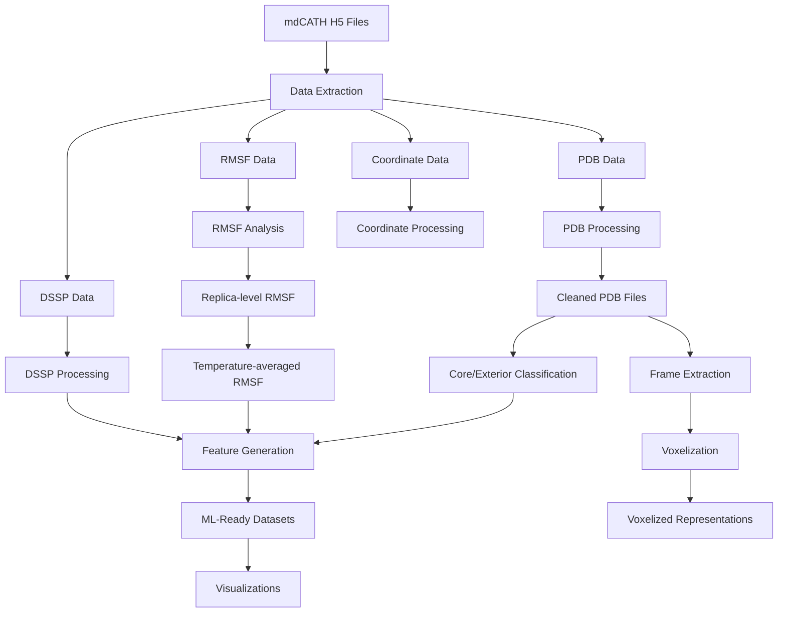

# 🧪 mdCATH Dataset Processor

[](https://opensource.org/licenses/MIT)
[](https://www.python.org/downloads/)
[](https://github.com/yourusername/mdcath-processor)
[](https://github.com/yourusername/mdcath-processor)

A comprehensive suite for processing mdCATH protein dynamics dataset to facilitate machine learning-based prediction of Root Mean Square Fluctuation (RMSF) from protein structures.

---

## 📑 Table of Contents

<div style="display: grid; grid-template-columns: 1fr 1fr; grid-gap: 20px; margin-bottom: 30px;">
<div>

### Getting Started
- [🌟 Overview](#-overview)
- [🔬 Key Features](#-key-features)
- [⚙️ Installation](#️-installation)
- [🚀 Quick Start](#-quick-start)
  
### Core Documentation
- [🔄 Dataflow Pipeline](#-dataflow-pipeline)
- [🛠️ Configuration Options](#️-configuration-options)
- [📊 Output Examples](#-output-examples)

</div>
<div>

### Technical Details
- [📂 Project Structure](#-project-structure)
- [🧩 Modules Explained](#-modules-explained)
- [🔮 Advanced Usage](#-advanced-usage)

### Resources
- [📚 API Reference](#-api-reference)
- [🐞 Troubleshooting](#-troubleshooting)
- [🤝 Contributing](#-contributing)
- [📜 License](#-license)

</div>
</div>

---

## 🌟 Overview

The mdCATH Dataset Processor is designed to transform raw molecular dynamics data from the mdCATH dataset into structured, analysis-ready formats optimized for machine learning applications. This pipeline extracts, processes, and organizes protein dynamics data, with a focus on Root Mean Square Fluctuation (RMSF) prediction.

By providing a consistent framework for data preparation, this project enables researchers to develop machine learning models that can accurately predict protein dynamics from structural features alone, potentially accelerating drug discovery and protein engineering efforts.

## 🔬 Key Features

- **Comprehensive Data Extraction**: Extract RMSF, DSSP, and coordinate data from mdCATH H5 files
- **Sophisticated PDB Processing**: Clean and standardize PDB files for downstream analysis
- **Multi-temperature Analysis**: Process data across multiple temperatures (320K-450K) and replicas
- **Core/Exterior Classification**: Classify protein residues as core or exterior using MSMS or BioSASA
- **ML-Ready Feature Generation**: Create feature sets optimized for machine learning applications
- **Insightful Visualizations**: Generate publication-quality visualizations of RMSF distributions and correlations
- **Voxelized Representation**: Convert protein structures to voxelized format for 3D deep learning

## ⚙️ Installation

### Prerequisites

- Python 3.9+
- MSMS (optional, for enhanced surface calculations)
- aposteriori (optional, for voxelization)

### Setup

1. Clone the repository:
```bash
git clone https://github.com/yourusername/mdcath-processor.git
cd mdcath-processor
```

2. Install dependencies:
```bash
pip install -r requirements.txt
```

3. Install additional tools:
```bash
# For voxelization support
pip install aposteriori

# For enhanced PDB handling
pip install pdbUtils
```

4. Verify installation:
```bash
python check_environment.py
```

## 🚀 Quick Start

### Basic Usage

```bash
# Process default domains with standard settings
python main.py

# Process specific domains
python main.py --domain_ids 1a02F00 1a0aA00

# Use custom configuration
python main.py --config my_config.yaml
```

### Example Workflow

```python
import mdcath

# Initialize processor with custom config
processor = mdcath.Processor('config.yaml')

# Process specific domains
results = processor.process_domains(['1a02F00', '1a0aA00'])

# Generate visualizations
processor.generate_visualizations(results)

# Access processed data
rmsf_data = results['rmsf_data']
feature_data = results['feature_data']
```

## 🔄 Dataflow Pipeline

The mdCATH processor transforms raw H5 data through a sophisticated pipeline of processing steps:



### Detailed Process Flow:

1. **Data Extraction**
   - Raw H5 files are parsed to extract PDB structures, RMSF values, DSSP annotations, and atomic coordinates
   - Data is organized by temperature and replica

2. **PDB Processing**
   - PDB files are cleaned and standardized
   - Atom numbering is fixed, and unusual residue names are corrected
   - CRYST1 records are added for compatibility with analysis tools

3. **RMSF Analysis**
   - RMSF data is calculated for each residue across different replicas
   - Temperature-specific and temperature-averaged RMSF profiles are generated

4. **Structure Classification**
   - Residues are classified as core or exterior based on solvent accessibility
   - MSMS or Biopython's SASA calculations are used for this classification

5. **Feature Generation**
   - Features are created by combining RMSF, structural, and sequence information
   - Data is normalized and encoded for machine learning applications

6. **Visualization & Output**
   - Multiple visualizations are generated to provide insights into the data
   - All processed data is saved in structured formats for downstream use

## 🛠️ Configuration Options

The processing pipeline is highly configurable via a YAML configuration file. Here's a detailed breakdown of the key parameters:

### Input/Output Configuration

```yaml
input:
  mdcath_folder: "/path/to/mdcath/data"  # Path to raw H5 files
  domain_ids: ["1a02F00", "1a0aA00"]     # Domains to process (empty for all)

temperatures: [320, 348, 379, 413, 450]  # Temperatures to process
num_replicas: 5                          # Number of replicas per temperature

output:
  base_dir: "./outputs"                  # Base directory for all outputs
```

### Processing Parameters

#### PDB Cleaning Options

```yaml
processing:
  pdb_cleaning:
    replace_chain_0_with_A: true         # Replace chain '0' with 'A'
    fix_atom_numbering: true             # Fix inconsistent atom numbering
    correct_unusual_residue_names: true  # Convert non-standard residue names
    add_cryst1_record: true              # Add CRYST1 record for compatibility
    remove_hydrogens: false              # Remove hydrogen atoms
    remove_solvent_ions: true            # Remove water and ion molecules
    stop_after_ter: true                 # Stop processing after TER record
```

#### Core/Exterior Classification

```yaml
processing:
  core_exterior:
    method: "msms"                       # Options: msms, biopython, fallback
    msms_executable_dir: "./msms_executables"
    ses_threshold: 1.0                   # Threshold for MSMS (Ų)
    sasa_threshold: 20.0                 # Threshold for Biopython SASA (Ų)
```

#### ML Feature Extraction

```yaml
processing:
  ml_feature_extraction:
    min_residues_per_domain: 0           # Min residues filter
    max_residues_per_domain: 50000       # Max residues filter
    normalize_features: true             # Normalize numeric features
    include_secondary_structure: true    # Include DSSP features
    include_core_exterior: true          # Include core/exterior classification
    include_dssp: true                   # Include per-residue DSSP data
```

#### Voxelization Settings

```yaml
processing:
  voxelization:
    frame_edge_length: 12.0              # Physical size of voxel grid (Å)
    voxels_per_side: 21                  # Grid resolution
    atom_encoder: "CNOCBCA"              # Atom types to include
    encode_cb: true                      # Include CB atoms
    compression_gzip: true               # Compress output files
```

#### Performance Tuning

```yaml
performance:
  num_cores: 0                           # 0 = auto-detect
  batch_size: 100                        # Batch size for parallel processing
  memory_limit_gb: 0                     # 0 = no limit
  use_gpu: true                          # Use GPU acceleration if available
```

### Configuration Examples

#### Minimal Configuration

```yaml
input:
  mdcath_folder: "/data/mdcath"
  domain_ids: ["1a02F00"]
temperatures: [320]
num_replicas: 1
output:
  base_dir: "./minimal_output"
```

#### High-Performance Configuration

```yaml
input:
  mdcath_folder: "/data/mdcath"
  domain_ids: []  # Process all domains
temperatures: [320, 348, 379, 413, 450]
num_replicas: 5
output:
  base_dir: "./full_output"
performance:
  num_cores: 16
  memory_limit_gb: 32
  use_gpu: true
```

#### Custom Processing Configuration

```yaml
processing:
  frame_selection:
    method: "rmsd"  # Select frames based on RMSD clustering
    num_frames: 5   # Extract 5 representative frames
    cluster_method: "kmeans"
  core_exterior:
    method: "biopython"  # Use Biopython for surface calculations
  ml_feature_extraction:
    normalize_features: true
    include_dssp: true
```

## 📊 Output Examples

The mdCATH processor generates multiple structured outputs for analysis and modeling. Here are key examples:

### 1. RMSF Analysis Results

**File: `outputs/RMSF/replica_average/average/rmsf_all_temperatures_all_replicas.csv`**

```csv
domain_id,resid,resname,rmsf_320,rmsf_348,rmsf_379,rmsf_413,rmsf_450,rmsf_average
1a0aA00,0,MET,1.3483024,1.4334629,1.4772995,1.535583,1.5951369,1.477957
1a0aA00,1,LYS,1.1942909,1.2852292,1.3467977,1.3957214,1.4604483,1.3364975
1a0aA00,2,ARG,1.0236586,1.1520655,1.2123555,1.2685184,1.3335836,1.1980364
```

This file contains average RMSF values across replicas and temperatures for each residue, showing how flexibility changes with temperature.

### 2. ML-Ready Feature Datasets

**File: `outputs/ML_features/final_dataset_temperature_average.csv`**

```csv
domain_id,resid,resname,rmsf_320,protein_size,normalized_resid,core_exterior,relative_accessibility,dssp,resname_encoded,core_exterior_encoded,secondary_structure_encoded,rmsf_average
1a0aA00,0,MET,1.3483024,63,0.0,exterior,0.9521276595744681,C,13,1,2,1.3483024
1a0aA00,1,LYS,1.1942909,63,0.016129032258064516,exterior,0.6341463414634146,T,12,1,2,1.1942909
```

This dataset combines RMSF values with structural features:
- `protein_size`: Total number of residues in the protein
- `normalized_resid`: Position in the sequence (normalized 0-1)
- `core_exterior`: Whether the residue is buried or exposed
- `relative_accessibility`: Relative solvent accessibility
- `dssp`: Secondary structure assignment
- Encoded versions of categorical features

### 3. PDB Files and Frames

**PDB File: `outputs/pdbs/1a0aA00.pdb`**

```
CRYST1  100.000  100.000  100.000  90.00  90.00  90.00 P 1           1
ATOM      1 N    MET A   0     -13.223 -22.589  20.858  0.00  0.00           C  
ATOM      2 HY1  MET A   0     -13.643 -23.328  21.385  0.00  0.00           H  
ATOM      3 HY2  MET A   0     -13.780 -22.385  20.054  0.00  0.00           H  
...
```

**Frame File: `outputs/frames/replica_0/320/1a0aA00_frame.pdb`**

```
CRYST1  100.000  100.000  100.000  90.00  90.00  90.00 P 1           1
ATOM      1 N    MET A   0     195.640  59.670-110.600  0.00  0.00            C  
ATOM      2 HY1  MET A   0     195.640  59.670-110.600  0.00  0.00            H  
...
```

These files represent:
- Cleaned, standardized PDB structures
- Extracted frames from the molecular dynamics trajectories

### 4. Visualizations

**RMSF Distribution: `outputs/visualizations/rmsf_violin_plot.png`**

A violin plot showing the distribution of RMSF values across different temperatures, highlighting how flexibility changes with temperature.

**Structure-RMSF Correlation: `outputs/visualizations/dssp_rmsf_correlation_plot.png`**

A bar plot showing the relationship between secondary structure elements and RMSF values, revealing which structural elements are more flexible.

**Feature Correlations: `outputs/visualizations/feature_correlation_plot.png`**

A heatmap of correlations between different features, helping to identify which structural properties most strongly predict flexibility.

## 📂 Project Structure

The mdCATH processor is organized into a modular structure:

```
mdcath-processor/
├── main.py                  # Main entry point
├── setup.py                 # Installation setup
├── requirements.txt         # Dependencies
├── check_environment.py     # Environment verification
├── LICENSE                  # MIT License
├── README.md                # This documentation
├── msms_executables/        # Surface calculation tools
├── src/                     # Source code
│   └── mdcath/              # Main package
│       ├── __init__.py      # Package initialization
│       ├── config/          # Configuration handling
│       │   ├── __init__.py
│       │   └── default_config.yaml
│       ├── core/            # Core functionality
│       │   ├── __init__.py
│       │   └── data_loader.py
│       └── processing/      # Processing modules
│           ├── __init__.py
│           ├── core_exterior.py
│           ├── features.py
│           ├── pdb.py
│           ├── rmsf.py
│           ├── visualization.py
│           └── voxelizer.py
└── outputs/                 # Generated outputs
    ├── frames/              # Extracted frames
    ├── ML_features/         # Feature datasets
    ├── pdbs/                # Cleaned PDB files
    ├── RMSF/                # RMSF analysis
    ├── visualizations/      # Generated plots
    └── voxelized/           # Voxelized data
```

## 🧩 Modules Explained

### Core Modules

#### `data_loader.py`

The heart of the data extraction process, this module handles the reading and parsing of H5 files:

- `H5DataLoader`: Class for efficiently extracting data from mdCATH H5 files
  - `extract_rmsf()`: Extracts RMSF data for specific temperature/replica
  - `extract_pdb()`: Extracts PDB structure data
  - `extract_dssp()`: Extracts secondary structure assignments
  - `extract_coordinates()`: Extracts atomic coordinates

#### `core_exterior.py`

This module classifies protein residues as core (buried) or exterior (exposed):

- `compute_core_exterior()`: Main function for classification
- `compute_core_exterior_msms()`: Uses MSMS for precise surface calculation
- `compute_core_exterior_biopython()`: Alternative using Biopython's SASA
- `fallback_core_exterior()`: Simple geometric approximation as fallback

#### `rmsf.py`

Handles the extraction and processing of RMSF data:

- `calculate_replica_averages()`: Averages RMSF across replicas
- `calculate_temperature_average()`: Averages RMSF across temperatures
- `process_rmsf_data()`: High-level function for RMSF processing

### Processing Modules

#### `pdb.py`

Handles PDB file processing and cleaning:

- `fix_pdb()`: Main function for cleaning PDB files
- `fix_pdb_with_pdbutils()`: Enhanced cleaning using pdbUtils
- `fix_pdb_fallback()`: Simple cleaning as fallback
- `extract_frames()`: Extracts frames from coordinate data

#### `features.py`

Generates ML-ready feature datasets:

- `generate_ml_features()`: Creates feature datasets by combining RMSF, structural, and sequence data
- `process_ml_features()`: High-level function for feature generation

#### `voxelizer.py`

Converts protein structures to voxelized representations:

- `voxelize_domains()`: Converts PDB files to voxelized format using aposteriori

#### `visualization.py`

Generates various visualizations of the processed data:

- `create_temperature_summary_heatmap()`: RMSF by temperature heatmap
- `create_rmsf_distribution_plots()`: Violin plots and histograms
- `create_dssp_rmsf_correlation_plot()`: Relationship between structure and flexibility
- `create_feature_correlation_plot()`: Correlation between features

## 🔮 Advanced Usage

### Custom Processing Workflows

You can create custom workflows by directly using the module functions:

```python
from mdcath.core.data_loader import H5DataLoader
from mdcath.processing import pdb, rmsf, features, visualization

# Custom data loading
loader = H5DataLoader("path/to/mdcath_dataset_1a02F00.h5", config)
pdb_data = loader.extract_pdb()
rmsf_data = loader.extract_rmsf("320", "0")

# Custom PDB processing
pdb.save_pdb_file(pdb_data, "custom_output/1a02F00.pdb", config)

# Custom feature generation
custom_features = features.generate_ml_features(
    rmsf_data=rmsf_results,
    core_exterior_data=core_ext_data,
    dssp_data=dssp_data,
    config=custom_config
)
```

### Integration with ML Frameworks

The generated features can be directly used with popular ML frameworks:

```python
import pandas as pd
from sklearn.ensemble import RandomForestRegressor
import torch
from torch import nn

# Using with scikit-learn
features_df = pd.read_csv("outputs/ML_features/final_dataset_temperature_average.csv")
X = features_df[['normalized_resid', 'core_exterior_encoded', 'secondary_structure_encoded']]
y = features_df['rmsf_average']

model = RandomForestRegressor()
model.fit(X, y)

# Using with PyTorch
class RMSFPredictor(nn.Module):
    def __init__(self):
        super().__init__()
        self.model = nn.Sequential(
            nn.Linear(10, 64),
            nn.ReLU(),
            nn.Linear(64, 1)
        )
    
    def forward(self, x):
        return self.model(x)
```

### Voxelized Data for 3D CNNs

```python
import h5py
import torch
import torch.nn as nn

# Load voxelized data
with h5py.File("outputs/voxelized/mdcath_voxelized.hdf5", "r") as f:
    # Shape: [batch, channels, depth, height, width]
    voxel_data = torch.tensor(f["1a02F00/A"][:])

# 3D CNN for voxelized proteins
class Protein3DCNN(nn.Module):
    def __init__(self):
        super().__init__()
        self.conv1 = nn.Conv3d(6, 32, kernel_size=3, padding=1)
        self.pool = nn.MaxPool3d(2)
        self.conv2 = nn.Conv3d(32, 64, kernel_size=3, padding=1)
        self.fc = nn.Linear(64 * 5 * 5 * 5, 1)
        
    def forward(self, x):
        x = self.pool(torch.relu(self.conv1(x)))
        x = self.pool(torch.relu(self.conv2(x)))
        x = x.view(-1, 64 * 5 * 5 * 5)
        x = self.fc(x)
        return x
```

## 📚 API Reference

### Main Package

```python
mdcath.__version__  # Get package version
```

### Configuration Module

```python
from mdcath.config import load_config, save_config

# Load config from file
config = load_config("path/to/config.yaml")

# Modify config
config["temperatures"] = [320, 348]

# Save modified config
save_config(config, "new_config.yaml")
```

### Processing Functions

```python
from mdcath.processing import pdb, rmsf, features, visualization, voxelizer

# Process PDB files
pdb_results = pdb.process_pdb_data(domain_results, config)

# Process RMSF data
rmsf_results = rmsf.process_rmsf_data(domain_results, config)

# Generate ML features
ml_results = features.process_ml_features(rmsf_results, pdb_results, domain_results, config)

# Create visualizations
vis_results = visualization.generate_visualizations(rmsf_results, ml_results, domain_results, config)

# Voxelize domains
voxel_results = voxelizer.voxelize_domains(pdb_results, config)
```

## 🐞 Troubleshooting

### Common Issues

#### Missing MSMS Executables

```
WARNING: MSMS executables not found in ./msms_executables, falling back to Biopython
```

**Solution**: Ensure MSMS is properly installed and the path in config is correct:
```yaml
processing:
  core_exterior:
    msms_executable_dir: "/correct/path/to/msms_executables"
```

#### H5 File Format Errors

```
ERROR: Failed to validate H5 file structure for domain 1a02F00
```

**Solution**: Ensure you're using the correct mdCATH dataset version and the H5 files have the expected structure.

#### Memory Issues with Large Datasets

```
ERROR: Memory error when processing domain 12asA00
```

**Solution**: Adjust memory limits and batch size in config:
```yaml
performance:
  batch_size: 50  # Process fewer domains at once
  memory_limit_gb: 16  # Limit memory usage
```

### Getting Help

If you encounter issues not covered here, please:
1. Check the logs in `mdcath_processing.log`
2. Open an issue on GitHub with the error details
3. Contact the maintainers at example@email.com

## 🤝 Contributing

Contributions to the mdCATH processor are welcome! Here's how to get started:

1. Fork the repository
2. Create a feature branch: `git checkout -b feature/amazing-feature`
3. Make your changes
4. Run tests: `python -m unittest discover tests`
5. Commit your changes: `git commit -m 'Add amazing feature'`
6. Push to the branch: `git push origin feature/amazing-feature`
7. Open a Pull Request

### Development Setup

```bash
# Clone repository
git clone https://github.com/yourusername/mdcath-processor.git
cd mdcath-processor

# Install dev dependencies
pip install -r requirements-dev.txt

# Create a branch
git checkout -b feature/my-feature

# Run tests
python -m unittest discover tests
```

## 📜 License

This project is licensed under the MIT License - see the [LICENSE](LICENSE) file for details.

```
MIT License

Copyright (c) 2025 mdCATH Processing Project

Permission is hereby granted, free of charge, to any person obtaining a copy
of this software and associated documentation files (the "Software"), to deal
in the Software without restriction, including without limitation the rights
to use, copy, modify, merge, publish, distribute, sublicense, and/or sell
copies of the Software, and to permit persons to whom the Software is
furnished to do so, subject to the following conditions:

The above copyright notice and this permission notice shall be included in all
copies or substantial portions of the Software.
```

---

<p align="center">
  <a href="https://github.com/Felixburton7/mdcath-processor2">
    
  </a>
</p>

<p align="center">
  <em>Developed with ❤️ for the scientific community.</em>
</p>
